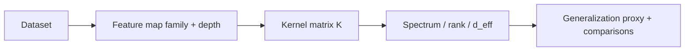

# Quantum Kernel Expressivity: Measuring Inductive Bias and Feature Complexity in Quantum Kernel Methods

*Expressivity analysis of quantum kernels with PennyLane & PyTorch*


[](https://www.python.org/downloads/)
[](https://opensource.org/licenses/MIT)
[](https://scholar.google.com/citations?user=tvwpCcgAAAAJ)
[](https://huggingface.co/Cohaerence)

[](https://x.com/coherence)
[](https://www.christopheraltman.com)
[](https://www.linkedin.com/in/Altman)
<!-- [](https://doi.org/10.5281/zenodo.XXXXXXX) -->


This repository investigates how expressivity in quantum kernels correlates with feature–space complexity, generalization behavior, and spectral properties of the associated kernel matrices across varying circuit depths, entangling structures, and feature encodings.

The implementation is built using PennyLane, PyTorch, and custom kernel-simulation utilities.

This repository contains reproducible implementations of:

- quantum kernel estimators for multiple feature maps
- expressivity metrics including rank, spectrum, and capacity measures
- controlled experiments comparing depth, width, and data regimes

All experiments can be executed directly via the provided scripts and notebooks. Default configurations reproduce the key expressivity results without modification.

---

### Equation rendering (LaTeX as SVG)
GitHub renders these equations via **Codecogs** (external) using SVG images:

<p align="center">
  
</p>

## Math Snapshot (Kernel expressivity metrics)

<p align="center">
  <picture>
    <source media="(prefers-color-scheme: dark)"
      srcset="https://latex.codecogs.com/svg.image?%5Cdpi{120}%5CLarge%20%5Ccolor%7Bwhite%7D%20K_%7Bij%7D%3D%7C%5Clangle%5Cpsi(x_i)%7C%5Cpsi(x_j)%5Crangle%7C%5E2">
    
  </picture>
</p>

<p align="center">
  <picture>
    <source media="(prefers-color-scheme: dark)"
      srcset="https://latex.codecogs.com/svg.image?%5Cdpi{120}%5CLarge%20%5Ccolor%7Bwhite%7D%20K%3DV%5CLambda%20V%5E%5Ctop%2C%20%5Cquad%20%5Clambda_1%5Cge%5Clambda_2%5Cge%5Ccdots">
    
  </picture>
</p>

<p align="center">
  <picture>
    <source media="(prefers-color-scheme: dark)"
      srcset="https://latex.codecogs.com/svg.image?%5Cdpi{120}%5CLarge%20%5Ccolor%7Bwhite%7D%20d_%5Ctext%7Beff%7D(%5Clambda)%3D%5Coperatorname%7BTr%7D%5Cleft(K(K%2B%5Clambda%20I)^{-1}%5Cright)">
    
  </picture>
</p>

<p align="center">
  <picture>
    <source media="(prefers-color-scheme: dark)"
      srcset="https://latex.codecogs.com/svg.image?%5Cdpi{120}%5CLarge%20%5Ccolor%7Bwhite%7D%20%5Cmathcal%7BA%7D(K%2Cyy%5E%5Ctop)%3D%5Cfrac%7B%5Clangle%20K%2Cyy%5E%5Ctop%5Crangle_F%7D%7B%5C%7CK%5C%7C_F%5C%7Cyy%5E%5Ctop%5C%7C_F%7D%20%5Cquad%20%5Ctext%7Bkernel-label%20alignment%7D">
    
  </picture>
</p>

---

## Pipeline



___

## Abstract

Quantum kernel methods provide a mechanism for embedding classical inputs into a high-dimensional feature space induced by parameterized quantum circuits. The expressivity of this embedding—determined by the structure, depth, and entanglement properties of the circuit—directly influences generalization performance, inductive bias, and sample complexity.

This repository explores these effects by constructing and analyzing multiple kernel ansätze, computing their induced Gram matrices, and evaluating how expressivity metrics vary with architectural parameters. We quantify changes in spectral signatures, rank profiles, embedding smoothness, and the geometry of feature space as circuit complexity increases.

___

## Methods and Contributions

This repository implements a reproducible expressivity benchmarking framework consisting of:

### Circuit and Kernel Variants
  - shallow (low-depth) vs deep feature-map circuits
  - deep feature maps with full entanglement layers
	- different entangling layouts (linear, full, block entanglement)
	- deterministic vs stochastic feature encoding mechanisms

### Expressivity Metrics Evaluated
  - eigenvalue distribution and spectral decay  
	- effective rank and trace-norm computation of Gram matrices
	- empirical concentration effects under repeated sampling
  - margin-based feature separation metrics
	- curvature in feature-space embeddings

### Core Experimental Contributions
  - side-by-side expressivity benchmarks across circuit configuration families
  - reproducible procedure for computing spectral expressivity metrics  
  - interpretable plots and spectral visualization pipeline
  - a complete execution pipeline suitable for research replication
  - modular design enabling new kernel families  

Implementations are built on PennyLane simulators with PyTorch integration for efficient batch processing execution.

## Repository Structure

```
├── src/
│   ├── kernels/                # Kernel constructors
│   ├── circuits/               # Feature map architectures
│   ├── metrics/                # Rank, spectrum, trace-norm utilities
│   ├── datasets/               # Synthetic dataset loaders
│   └── experiments/            # Orchestrated experiment routines
│
├── notebooks/
│   ├── exploratory/            # Interactive exploration notebooks
│   └── figures.ipynb           # Notebook to generate final figures
│
├── figures/                    # Generated plots, heatmaps, distributions
├── diagrams/                   # UML circuit diagrams or architecture sketches
├── requirements.txt
├── pyproject.toml
└── LICENSE
```

This structure is intentionally modular to support expansion into new circuit families and new kernel metrics.

---

## Experiment Suite

| Experiment ID | Circuit Family            | Parameter Varied        | Metric Evaluated                        | Artifact Output               |
|---------------|---------------------------|--------------------------|------------------------------------------|-------------------------------|
| EXP-01        | Shallow feature map       | depth {1..4}             | eigenvalue spectrum decay                | eigenvalue curves             |
| EXP-02        | Deep entangling structure | entanglement radius      | trace norm vs effective rank             | heatmaps, diagnostics         |
| EXP-03        | Random phase encoding     | randomness strength      | kernel smoothness & separability         | margin separation curves      |
| EXP-04        | Structured encoding       | dimensionality scaling   | generalization gap proxy                 | performance trend curves      |

Outputs are stored in `figures/`, or optionally `results/` when using batch execution.

---

## Installation & Usage

### Create environment
```
python3 -m venv .venv
source .venv/bin/activate
```
### Install dependencies
```
pip install -r requirements.txt
```
### Run example experiment
```
python src/experiments/run_expressivity.py --depth 4 --entanglement full
```
### Generate figures
```
python src/experiments/generate_figures.py
```
### Launch notebooks
```
jupyter lab
```
---

## References

1. C. Altman, J. Pykacz & R. Zapatrin, “Superpositional Quantum Network Topologies,” *International Journal of Theoretical Physics* 43, 2029–2041 (2004).
   DOI: [10.1023/B:IJTP.0000049008.51567.ec](https://doi.org/10.1023/B:IJTP.0000049008.51567.ec) · arXiv: [q-bio/0311016](https://arxiv.org/abs/q-bio/0311016)

2. C. Altman & R. Zapatrin, “Backpropagation in Adaptive Quantum Networks,” *International Journal of Theoretical Physics* 49, 2991–2997 (2010).  
   DOI: [10.1007/s10773-009-0103-1](https://doi.org/10.1007/s10773-009-0103-1) · arXiv: [0903.4416](https://arxiv.org/abs/0903.4416)


---

## Citations

If you use or build on this work, please cite:

> Quantum Kernel Expressivity: Measuring Inductive Bias and Feature Complexity in Quantum Kernel Methods

```bibtex
@software{altman2025quantum_kernel_expressivity,
  author = {Altman, Christopher},
  title = {Quantum Kernel Expressivity: Measuring Inductive Bias and Feature Complexity in Quantum Kernel Methods},
  year = {2025},
  url = {https://github.com/christopher-altman/quantum-kernel}
}
```

## License

MIT License. See [LICENSE](LICENSE) for details.

---

## Contact

- **Website:** [christopheraltman.com](https://christopheraltman.com)
- **GitHub:** [github.com/christopher-altman](https://github.com/christopher-altman)
- **Google Scholar:** [scholar.google.com/citations?user=tvwpCcgAAAAJ](https://scholar.google.com/citations?user=tvwpCcgAAAAJ)
- **Email:** x@christopheraltman.com

---

*Christopher Altman (2025)*


